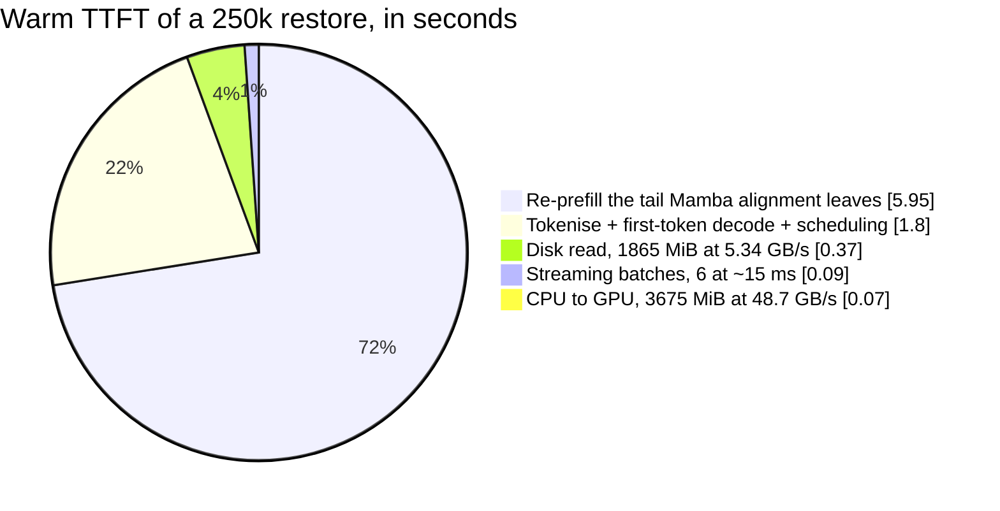
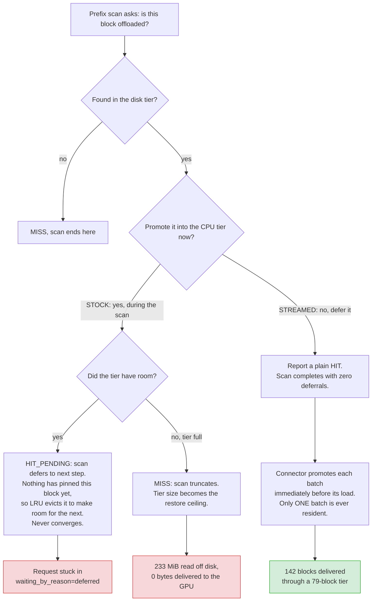
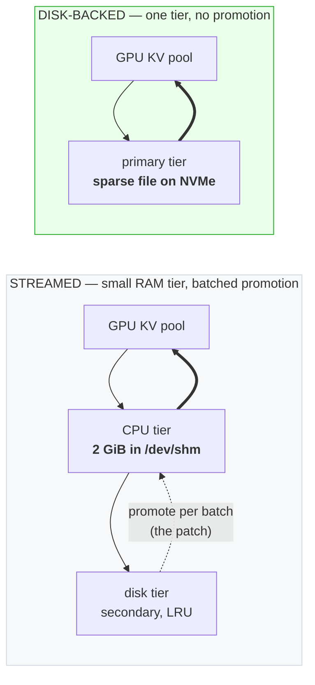
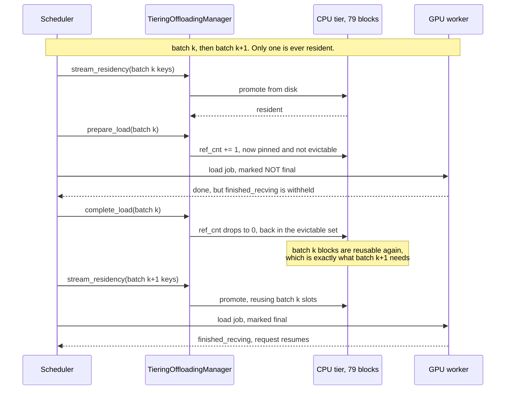
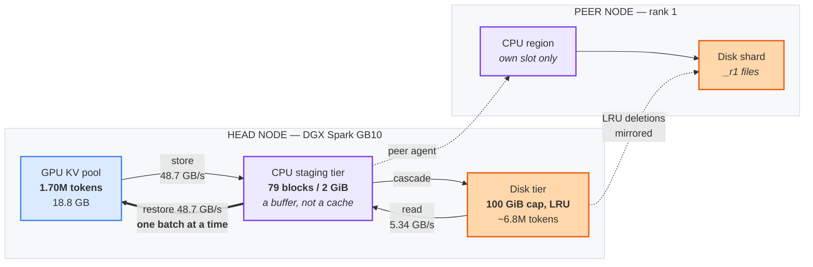

# Restore a 250k-token KV cache from disk in 8 seconds instead of prefilling it in 250


**Time to first token, same 250k-token prompt, same server:**

```text
cold prefill   ██████████████████████████████████████████████████  250.6 s
from disk      ██················································    8.3 s   30.2x faster
```

Out-of-tree fixes and hardening for vLLM's `OffloadingConnector`, developed against
`vllm 0.1.dev20051+g487ecf187` serving GLM-5.3-Flash (`Glm5Next`, EXL3 4bpw) at 1M context,
TP=2 across two NVIDIA DGX Spark (GB10) hosts.

Everything loads through vLLM's supported extension points — the two tier managers via
`secondary_tiers[].module_path`, the rest as an idempotent start-time source patch. vLLM
itself is never forked.

## Results

A **250k-token session**, evicted by flushing the entire 1.7M-token GPU pool, then
revisited so the KV genuinely comes back off disk. Answers verified against five needles at
10/30/50/70/90% depth, so a partially-restored prefix cannot pass as a full one.

| | cold prefill | restored from disk |
|---|---|---|
| **TTFT** | **250.6 s** | **8.3 s — 30.2× faster** |
| `cached_tokens` | — | **243,712 of 249,638 (97.6%)** |
| needle recall | 5/5 | **5/5** |

```text
how much of the 249,638-token prompt came back off disk

restored from disk  ████████████████████████████████████████████████·  243,712  (97.6%)
re-prefilled        ·················································    5,926   (2.4%)
```

Where those 8.3 s go — **the restore itself is about half a second**:



| | |
|---|---|
| re-prefilling the 5,926-token tail Mamba alignment leaves behind | 5.95 s |
| disk read, 1865 MiB @ **5.34 GB/s** | 0.37 s |
| CPU→GPU, 3675 MiB @ **48.7 GB/s** | 0.07 s |
| 6 streaming batches @ ~15 ms | 0.09 s |
| tokenisation, first-token decode, scheduling | ~1.8 s |

The leftover tail is bounded by a constant (≤ 7168 tokens), while the prefill you skip grows
linearly with depth — so this improves as sessions get deeper:

```text
         cold prefill                                 restored
  125k   ██████··································   148 s   █·······   8.4 s    17.6x
  250k   ██████████······························   251 s   █·······   8.3 s    30.2x
    1M   ████████████████████████████████████████  ~1000 s  █·······  ~8 s     ~125x  (projected)
```

| session | cold prefill | restored | speedup |
|---|---|---|---|
| 125k | 148 s | 8.4 s | **17.6×** |
| 250k | 251 s | 8.3 s | **30.2×** |
| 1M | ~1000 s | ~8 s | ~125× *(projected, not measured)* |

> [!NOTE]
> **These numbers were measured with the streamed restore enabled** (`patch_offload_streaming_restore.py`).
> That patch is no longer what this stack deploys — see
> [Update: the primary tier can be the disk tier](#update-the-primary-tier-can-be-the-disk-tier).
> The results stand as measured; they describe the streamed design, not the current one.

### The result stock vLLM cannot produce

That 250k restore moves **142 offload blocks through a 79-block CPU tier**. Stock vLLM
promotes every hit block *during* the prefix scan, so its 80th promotion fails, `lookup`
returns `MISS`, and the scan truncates there.



An A/B with everything else held identical — same 9-block tier, same documents, same disk
contents, same GPU pool — toggling only `GLM53_OFFLOAD_STREAM_RESTORE`:

| per revisit | stock | streamed |
|---|---|---|
| read from disk | 233 MiB | 256 MiB |
| **delivered to GPU** | **0 MiB** | **256 MiB** |
| load jobs issued | **0** | 10 |
| `cached_tokens` | **0** | **7168** |
| restores that happened | **0 / 6** | **6 / 6** |

> [!IMPORTANT]
> Stock does not merely restore *less* — **it pays the full disk read and then throws all of
> it away.** 233 MiB is exactly the whole tier: the scan promotes until the tier is full, the
> next promotion fails, and the truncated hit falls below the model's Mamba alignment unit,
> so it rounds to nothing and **no load job is ever issued**. Identical to the byte on all
> six revisits.

Repeated at 15.6k with 3 trials: **9/9 restores, 5/5 needle recall on 9 of 9, 0 stalls.**

### In production, under real load

The numbers above are controlled experiments. This is the same build serving a live
multi-agent coding workload — 18 concurrent agents, contexts from 26k to 205k, nobody
running a benchmark:

| | |
|---|---|
| GPU KV pool | **98% used**, 29 preemptions |
| requests | 7 running, 7 waiting (some on `capacity`, not just `deferred`) |
| **offload load jobs** | **722**, climbing ~100/min |
| **tokens served from disk** | **1.38M** |
| disk hit rate, sampled under pressure | **29.5%** of everything the GPU cache missed |

Those are tokens the agents would otherwise have re-prefilled.

### It engages from cache turnover, not from pool saturation

This is the part that is easy to get wrong, and we got it wrong first: you do **not** have to
fill the pool for offload to matter. Earlier the same day, with the pool at **47% and zero
preemptions**, 63.4% of prefix lookups were already missing the GPU cache and disk was
already serving them.

`BlockPool.free_blocks` appends *hashed* blocks to the back of the free queue and
`get_new_blocks` pops from the front, so **every allocation recycles the oldest cached
block** regardless of how full the pool is. Eviction is paced by allocation rate, not by
occupancy. With 13.2M prompt tokens through a 1.70M-token pool — **7.8× turnover** — every
cached prefix had been recycled several times over.

So the useful sizing question is not "will my working set exceed the pool" but "how much
prefix re-use is my workload losing to turnover".

### Reading the metrics: three that do not mean what they say

Each of these produced a wrong conclusion before it was caught:

| Metric | What it looks like | What it is |
|---|---|---|
| `kv_cache_usage_perc` | how much cache is retained | blocks allocated to **currently running** requests. 47% does not mean 53% of your cached prefixes survive |
| `prompt_tokens_total` | prefill work done | **all** prompt tokens submitted, cache hits included. In one window 70,656 of 73,376 were cached — real work was 45 tok/s, not 1,223. Use `prefix_cache_queries − hits` |
| `external_prefix_cache_hits / queries` | disk's hit rate | denominator includes **first-time content that can never hit**. Cumulative read 12.2%; sampled under real pressure, 29.5% |

And one label: `kv_offload_tiering_*` tags secondary tiers `tier="<idx>:<ClassName>"`, not
`tier="<idx>"`. Matching on `tier="0"` reports **zero disk hits for a run that took 155** —
the primary is `tier="0:primary"`. Match by excluding the primary, not by including an index.

### Capacity

```text
restorable context, in tokens

GPU KV pool    18.8 GB   ████████························  1.70M
disk tier     100 GiB    ████████████████████████████████  6.80M   ~4x the pool
```

100 GiB of disk holds **~6.8M tokens** of restorable context — about **4× the 1.7M-token GPU
pool** — at a measured 14.8 KB/token (`blocks = 2.00 × chunks + 5.9`, r² clean across the
125k and 250k runs). That is ~27 sessions at 250k, or ~52 at 125k.

## Update: the primary tier can be the disk tier

Everything above works by making a *small* CPU tier stream a *large* restore. There is a
simpler way to satisfy the same constraint, and this stack now deploys it instead.

vLLM admits a restore only when **every group's chunks are resident in the primary tier at
once**. The streamed restore dodges that invariant by reporting a plain `HIT` and making
chunks resident batch by batch. [MiaAI PR#58](https://github.com/MiaAI-Lab/GLM-5.3-Flash-EXL3-2x-DGX-Sparks/pull/58)
takes the other road: **back the primary tier's staging region with a sparse file on local
NVMe instead of `/dev/shm`**, so the tier can simply be large enough to satisfy the
invariant. No promotion step, no `HIT_PENDING` livelock, no tier-size ceiling — and nothing
to fight the scheduler over.



`patch_offload_mmap_region.py` does this in four edits, gated on `GLM53_OFFLOAD_MMAP_DIR`:
point the region at a file, skip the `/dev/shm` free-space check, never pre-fault it (a
sparse file would otherwise materialise in full), and skip `cudaHostRegister` on a mapping
that is no longer pinnable host RAM. Unset the variable and vLLM's `/dev/shm` behaviour is
untouched.

Only PR#58's region half is taken. Its group-exclusion half is not: that job is already done
by `patch_offload_nonshareable_groups.py`, which additionally carries the region-copies fix
that PR#58 does not have.

### The sizing rule: the tier must be larger than the GPU pool

This is the part worth stealing even if you take nothing else here.

The GPU pool and the tier are both LRU over the same stream of blocks. So a tier **smaller**
than the pool holds a strict subset of what the pool already has — the GPU answers first,
and the tier can never be the thing that serves a restore. Under-sizing it is not a smaller
cache, it is **no cache**, and it fails silently: stores still succeed and every store-side
metric still climbs while no restore ever serves.

The comparison is what matters, not a byte count — and the token capacity of a tier is
harder to pin down than it looks, so state it as a bound rather than a number:

```text
260 GB tier, restorable context under each reading of the row layout

GPU KV pool         1.90M  ████████
3 rows per segment  5.72M  ████████████████████████
5 rows per segment  3.43M  ██████████████
                           every reading clears the pool — which is the point
```

Capacity in tokens is `num_blocks x (3584 / rows_per_segment)`. `num_blocks` is exact, but
`rows_per_segment` is **bounded, not measured**: 1 row/segment is ruled out (a segment's
measured store exceeds what one row holds), leaving 3-5 on this stack. Size the tier so it
clears the pool under the *least* favourable reading and the ambiguity stops mattering.

> [!CAUTION]
> Do not size a tier from a naive sum of KV-group page sizes. That predicts 2.7 KB/token
> here; the measured store is **31.7 KB/token per rank** — 12x more. Rows are uniform and
> only partially filled, and the gap is layout, not waste. Measure `kv_offload_store_bytes_total`
> against tokens actually stored before trusting any figure.

Read the row size off your own boot rather than trusting a constant:
`num_blocks = cpu_bytes_to_use // aligned_kv_bytes_per_chunk`, and vLLM then creates a region
of exactly `num_blocks × aligned_kv_bytes_per_chunk`. On this stack that row is **54,329,344 B**,
confirmed twice — 32 GiB → 632 rows, 260 GB → 4785 rows, both exact.

### Where the block ids actually go

The boot-time capacity log explains why the offload footprint per token is what it is:

```text
ids per 3584-token cached segment across groups: 38
per group: [1, 0, 1, 1, 1, 1, 33]
                              ^^ group 6, SlidingWindowSpec, window=2048
```

**33 of the 38 GPU block ids per segment belong to one sliding-window group** — which the
offload filter excludes, since a 2048-token window is not worth shipping. Five ids per
segment are what actually reach the tier. Any capacity estimate that reasons from total GPU
block ids will therefore be wrong by ~7.6×.

### Status

Deployed and serving: 260 GB tier, KV pool pinned at 1.90× (770 usable block ids,
1,899,014 tokens), `GLM53_OFFLOAD_STREAM_RESTORE=0`, single tier with no secondary.

> [!WARNING]
> **Concurrency under this design is being measured and is not yet reported here.** The
> streamed restore's N ≥ 6 stall is expected to be structurally absent — there is no
> promotion step left to stall on — but *expected* is not *measured*, and this README does
> not carry unmeasured claims. The result will be added when the ramp completes.

```jsonc
// kv_transfer_config under the disk-backed design — note: no secondary_tiers
{"kv_connector": "OffloadingConnector", "kv_role": "kv_both",
 "kv_connector_extra_config": {
   "spec_name": "TieringOffloadingSpec",
   "cpu_bytes_to_use": 260000000000,   // must exceed the GPU KV pool
   "eviction_policy": "lru"}}
```

```sh
GLM53_OFFLOAD_MMAP_DIR=/kvoffload    # a directory on local NVMe, not /dev/shm
GLM53_OFFLOAD_GROUP_FILTER=1
GLM53_OFFLOAD_REGION_COPIES=<GPUs per node>
GLM53_OFFLOAD_STREAM_RESTORE=0       # superseded by the above
```

## How the streamed restore works

`patch_offload_streaming_restore.py`, gated on `GLM53_OFFLOAD_STREAM_RESTORE=1`:

1. **Let a restore span several load jobs.** `OffloadingConnectorWorker.get_finished`
   reports `finished_recving` as soon as *any* of a request's load jobs completes, which
   would resume the request against a partially-restored prefix. The worker is now told
   which job is the last and releases the request only then.
2. **One job per KV group.** Valid because `CPUGPUOffloadingWorker._transfer` walks groups
   positionally and short-circuits on `group_size == 0`, so a job carrying a single group
   works as long as `group_sizes` and `block_indices` keep full length with zeros elsewhere.
3. **Promote per batch.** This is what removes the cap. `TieringOffloadingManager.lookup`
   promoted during the prefix scan, and **both** outcomes tied restore size to tier size:
   `MISS` truncates the scan, and `HIT_PENDING` defers it into a livelock where LRU evicts
   blocks promoted a step earlier, because `prepare_load` has not pinned them yet. So
   `lookup` now reports a plain HIT and does not promote at all; the connector promotes each
   batch immediately before issuing its load, and only one batch is ever resident.



**It cannot deadlock.** `prepare_load` pins a block with `ref_cnt += 1` and `complete_load`
drops it back to 0, returning it to the evictable set — so batch *k*'s blocks are reusable
the moment its load completes. Progress is guaranteed as long as a single batch fits, which
is why batches are capped at half the tier (`GLM53_OFFLOAD_STREAM_BATCH_BLOCKS`, 0 = auto).

> [!WARNING]
> **The residual risk is liveness, not correctness.** Once `lookup` reports the larger hit
> vLLM has committed to it, and a queued batch holds no reference — so another request's
> stores could in principle evict its blocks from the disk tier mid-restore. The driver
> `touch()`es every queued key each step to keep them most-recently-used against that. A
> batch that stalls anyway hangs *that one request*, logged as an `ERROR`, and self-heals
> when the client disconnects. It never runs the model against a prefix that was not
> restored.

## The data path



Each rank writes only its **own** slot of the shared region and owns its own `_r<rank>`
files. Getting that wrong is upstream defect 3: a secondary tier that only ever touches the
local node's region restores zeros for every remote rank — silent KV corruption, which is
how it was found.

## Five upstream defects found on the way

| # | Defect | Symptom |
|---|---|---|
| 1 | The divisibility assert covers KV groups that opt out of prefix caching | `OffloadingConnector` cannot initialise at all |
| 2 | Those same groups stay in the hit lookup | offload is **write-only**: `CPU_to_GPU` stays at exactly 0 forever |
| 3 | A secondary tier only ever touches the local node's CPU region | **silent KV corruption** when the TP group spans hosts |
| 4 | The `/dev/shm` region is never unlinked | orphans accumulate until the startup memory gate fails |
| 5 | One uniform region row size for every group | 7× storage blow-up, ~90% of it from one drafter group |

Two of these produce wrong output with no error. Exact code sites and suggested fixes are in
[`UPSTREAM_ISSUE.md`](UPSTREAM_ISSUE.md).

Fixing 5 also halved the on-disk footprint — 51.81 MiB → **25.91 MiB** per region row, and
75.8 → **37.6 KB/token** on the same workload.

## Contents

| File | What it is |
|---|---|
| `patch_offload_streaming_restore.py` | The streamed restore: 19 idempotent, sentinel-guarded edits (12 scheduler, 4 worker, 1 metadata, 2 manager), gated on `GLM53_OFFLOAD_STREAM_RESTORE=1` |
| `patch_offload_mmap_region.py` | Backs the primary tier's staging region with a sparse file on local NVMe instead of `/dev/shm`, gated on `GLM53_OFFLOAD_MMAP_DIR` — ported from [MiaAI PR#58](https://github.com/MiaAI-Lab/GLM-5.3-Flash-EXL3-2x-DGX-Sparks/pull/58) |
| `patch_offload_nonshareable_groups.py` | Fixes defects 1, 2 and 5 plus row sizing, gated on `GLM53_OFFLOAD_GROUP_FILTER=1` |
| `vllm_bounded_fs_tier.py` | `BoundedFileSystemTierManager` (byte cap + LRU) and `PeerMirroredFileSystemTierManager` (per-rank cascade, own-slot writes — fixes defect 3) |
| `peer_kv_agent.py` | Runs in each remote rank's container; performs that rank's own cascade and promotion against its own region and `_r<rank>` files |
| `tests/` | Offline suites — the patch chain against pristine upstream sources, and the batch-split arithmetic |
| `probes/` | Every measurement harness used in this work, including the needle probes and the restore-cost fit behind the numbers above |

Both patches are idempotent, sentinel-guarded, and **fail closed** if upstream drifts: an
anchor that no longer matches exactly once aborts the patch rather than half-applying it.

## Usage

```jsonc
// kv_transfer_config
{"kv_connector": "OffloadingConnector", "kv_role": "kv_both",
 "kv_connector_extra_config": {
   "spec_name": "TieringOffloadingSpec",
   "cpu_bytes_to_use": 2147483648,          // staging buffer, not a cache
   "eviction_policy": "lru",
   "secondary_tiers": [{
     "type": "PeerMirroredFileSystemTierManager",
     "module_path": "vllm_bounded_fs_tier",  // put this file on PYTHONPATH
     "root_dir": "/kvoffload",
     "max_bytes": 107374182400,              // hard cap, enforced on every rank
     "evict_to_ratio": 0.9,
     "n_read_threads": 8, "n_write_threads": 8}]}}
```

Then apply the patches at container start (before the engine imports vLLM) and set:

```sh
GLM53_OFFLOAD_GROUP_FILTER=1
GLM53_OFFLOAD_STREAM_RESTORE=1
GLM53_OFFLOAD_REGION_COPIES=<GPUs per node>   # see note below
```

### Operational notes

> [!TIP]
> **The CPU tier is a staging buffer, not a cache.** With the streamed restore its size no
> longer caps restore depth — it sets the batch size, hence the number of engine steps
> (a 1M restore is ~15 batches ~ 0.2 s at a 2 GiB tier). Size it for how many restores you
> want *in flight at once*, not for how deep they are. This inverts the usual advice.

* **Fund the tier from the KV pool, not on top of it.** On unified memory (GB10) the CPU
  tier and the GPU pool draw on the same RAM.
* **`max_bytes` bounds every rank.** The head enforces it with LRU and mirrors each deletion
  to the peers; each peer also sweeps its own shard oldest-first against the same cap as a
  backstop, so a dropped message cannot leak disk.
* **`GLM53_OFFLOAD_REGION_COPIES`** sizes region rows by the workers that actually *share* a
  region. `tiering/spec.py` picks a worker's slot as
  `torch.accelerator.current_device_index() % world_size`, which is the global rank only
  when all workers sit on one node; with one GPU per host it is 0 everywhere, so every
  worker uses slot 0 while rows are still sized for `world_size`. Opt-in and clamped — a
  value below the real GPUs-per-node would make co-located workers share a slot and corrupt
  each other.
* **Clear `/dev/shm/vllm_offload_*.mmap` before launch** (defect 4) — or sidestep it with
  `GLM53_OFFLOAD_MMAP_DIR`, which moves the region out of `/dev/shm` entirely. Count with a shell
  glob, not `ls | wc -l` — `ls` exits 2 on no match, and under `set -e -o pipefail` that
  silently kills the launch the moment the cleanup has nothing left to do.
* **`PYTHONHASHSEED` must be fixed and identical everywhere**, or vLLM seeds its
  block-content hash chain randomly and identical tokens map to different filenames on every
  restart.

## Running the tests

```sh
python3 tests/test_stream_split.py        # split arithmetic, 8 property classes
python3 tests/test_streaming_patch.py     # the patch chain vs pristine upstream
python3 probes/test_w30_2b_probe.py       # the needle probe's own scoring
python3 probes/test_w30_probe.py
python3 probes/test_mamba_probe.py
```

These need only a Python 3 interpreter. The two patch-chain tests apply the edits to real
vLLM sources — point them at a copy with `PRISTINE=/path/to/site-packages/vllm`, and they
skip with a clear message if it is absent.

They are not decoration. `test_streaming_patch.py` caught four real defects before any
container start, including an `@override` decorator an anchor had clipped — which would have
silently detached `prepare_load` from its decorator — and a scheduler anchor that only exists
after the other patch has run. `test_stream_split.py` extracts the shipped function from the
patched source rather than testing a copy of it, and covers the case where losing the
intra-chunk offset would shift blocks by less than one chunk: KV that loads without error and
is quietly wrong.

`tests/test_bounded_fs_tier.py` and `tests/test_peer_cascade.py` are contract tests against
the real vLLM classes and import `vllm`, so they need it installed. That is their purpose —
an engine upgrade that moves an API fails there rather than silently corrupting KV.

## Limits

> [!NOTE]
> Every number above is measured on this stack unless explicitly marked *projected*. The
> A/B toggles one environment variable and holds hardware, model, prompts, disk contents and
> pool size constant.


* **Restore depth is now bounded by Mamba `align`, not by the tier.** The restorable prefix
  rounds down to an aligned chunk boundary, leaving ≤ 7168 tokens to re-prefill — which is
  most of the 8.3 s above.
* **Below ~130k tokens the restore fits a 2 GiB tier**, so stock vLLM serves it too and
  streaming buys nothing. The gain is in deep sessions.
* **The streamed restore stalls at N ≥ 6 concurrent deep restores.** An earlier version of
  this section predicted that surplus restores would "retry and serialise rather than fail".
  **That prediction was wrong and the measurement contradicted it.** N=2 and N=4 are clean;
  from N=6 the requests end in `WAITING_FOR_REMOTE_KVS` with the final batch never issued.
  Bisecting with `GLM53_OFFLOAD_STREAM_RESTORE=0` showed pristine vLLM completing the same
  wave, which isolates the defect to `patch_offload_streaming_restore.py` — not to vLLM. One
  real bug was found and fixed on the way (async-lookup `RETRY` churn, fixed with a memo);
  the stall itself is **not fixed**. Treat the streamed restore as sequential-only.
* **A residual 1.64× storage overhead remains**: rows are uniform across groups, so a
  2.48 MiB MLA payload still occupies a 25.91 MiB row. Removing it needs ragged per-group
  rows across `config.py`, `cpu/spec.py`, `shared_offload_region.py` and the CPU worker's
  offset arithmetic.
* **The first restore after a boot behaves as cold**, before the disk cascade has settled.
  Both anomalies across 15 revisits were first-after-boot; don't read one as corruption.

## Credits

This work is built on two upstream efforts, and the disk-backed design is theirs, not ours:

* **[MiaAI-Lab/GLM-5.3-Flash-EXL3-2x-DGX-Sparks#58](https://github.com/MiaAI-Lab/GLM-5.3-Flash-EXL3-2x-DGX-Sparks/pull/58)**
  ([@MiaAI_lab](https://x.com/MiaAI_lab)) — the disk-backed staging region, the residency
  invariant stated plainly enough to explain a stall we had been chasing from the wrong end,
  and the observation that under-sizing the tier fails silently with every store-side metric
  still climbing.
* **The Reederey87 GLM-5.3-Flash EXL3 serving kit** ([@Reederey](https://x.com/Reederey)) —
  the serving recipe this entire stack runs on: the two-node TP=2 bring-up, the overlay
  patch mechanism (idempotent, sentinel-guarded, fail-closed) that every patch here follows,
  and the boot-time capacity log that produced the block-id breakdown above.

The out-of-tree tier managers, the group/row-sizing fixes, the streamed restore and the
measurement harnesses in `probes/` are this repository's own.

## Licence

Apache-2.0. Not affiliated with the vLLM project.
