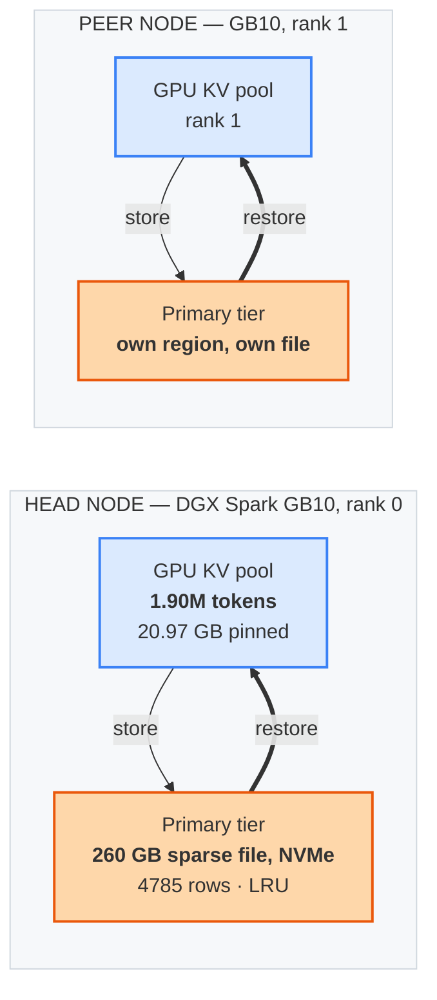

# Eight agents resume 480k tokens of context in 76 seconds instead of prefilling for 9 minutes


```text
eight agents, ~60k tokens of context each, all resuming at once

prefill it   ████████████████████████████████████████████████████  532 s
restore it   ███████·············································   75.6 s   7.0x
```

Out-of-tree fixes and hardening for vLLM's `OffloadingConnector`, developed against
`vllm 0.1.dev20051+g487ecf187` serving GLM-5.3-Flash (`Glm5Next`, EXL3 4bpw) at 1M context,
TP=2 across two NVIDIA DGX Spark (GB10) hosts.

The KV cache tier lives in a **sparse file on local NVMe** rather than in RAM, so it can be
larger than the GPU pool it backs. Everything loads through vLLM's supported extension
points as idempotent start-time source patches. vLLM itself is never forked.

## Results

Twenty sessions of ~60k tokens, each evicted by pushing **2.00M tokens of filler** through
the GPU pool so a revisit genuinely comes back off disk, then restored in concurrent waves.
Every session carries five needles at 10/30/50/70/90% depth **and** a session-unique prefix,
so a truncated restore and a cross-session mix-up are distinguishable from each other.

| N | wall | needle recall | stalls | tier alloc retries | throughput vs prefill |
|---|---|---|---|---|---|
| 2 | 18.7 s | 5/5 × 2 | 0 | 0 | **7.1×** |
| 4 | 32.8 s | 5/5 × 4 | 0 | 0 | **8.1×** |
| 6 | 47.3 s | 5/5 × 6 | 0 | 0 | **8.4×** |
| 8 | 75.6 s | 5/5 × 8 | 0 | 0 | **7.0×** |

**20 of 20 restores correct. No stalls, no timeouts, no tier pressure at any rung.**

```text
throughput gain per wave, against the same tokens prefilled at a measured 902 tok/s

N=2  ███████████████████████████████████·······  7.1x
N=4  ████████████████████████████████████████··  8.1x
N=6  ██████████████████████████████████████████  8.4x
N=8  ██████████████████████████████████········  7.0x
```

A single restore against a cold prefill of the same prompt, same server:

| | cold prefill | restored from disk |
|---|---|---|
| **TTFT** | 63.2 s | **15.9 s — 4.0× faster** |
| `cached_tokens` | — | **53,760 of ~60,000 (89.6%)** |
| needle recall | 5/5 | **5/5** |

The 6,240 tokens that are re-prefilled are the Mamba alignment tail: the restorable prefix
rounds down to an aligned chunk boundary, leaving a remainder bounded by a **constant**
(≤ 7168 tokens) while the prefill you skip grows with depth. Deeper sessions therefore do
strictly better than the 4.0× above.

> [!IMPORTANT]
> **Measure the wave, not the request.** Per-session TTFT decays from 4.0× at N=2 to 0.9× at
> N=8, which reads like the benefit evaporating. It is not — that ratio compares *concurrent*
> restores against a *sequential* cold prefill, a baseline nobody gets on a loaded server.
> Against the same tokens prefilled at the measured rate, the gain is flat at 7–8× across
> every rung. Concurrency costs per-request latency, not throughput.

Measured at: tier 260 GB, GPU KV pool pinned to 1,899,014 tokens (770 usable block ids),
`max_num_seqs=16`. Zero NVRM allocation faults across the entire ramp, host MemFree steady
at 1.1–1.3 GiB under eight concurrent deep restores.

## How it works

vLLM admits a restore only when **every KV group's chunks are resident in the primary tier
at once**. That invariant is what makes the tier's size the binding constraint — and the
straightforward way to satisfy it is to make the tier big, which RAM will not allow on a
machine whose RAM is already the GPU's.

So the staging region is backed by a **sparse file on local NVMe** instead of `/dev/shm`.
Four edits, gated on `GLM53_OFFLOAD_MMAP_DIR`: point the region at a file, skip the
`/dev/shm` free-space check, never pre-fault it (a sparse file would otherwise materialise in
full), and skip `cudaHostRegister` on a mapping that is no longer pinnable host RAM. Unset
the variable and vLLM's `/dev/shm` behaviour is untouched.



Each rank owns its own region and its own file. There is one tier, no promotion step between
tiers, and nothing to cascade or mirror between hosts.

### The sizing rule: the tier must be larger than the GPU pool

This is the part worth stealing even if you take nothing else here.

The GPU pool and the tier are both LRU over the same stream of blocks. A tier **smaller**
than the pool therefore holds a strict subset of what the pool already has — the GPU answers
first, and the tier can never be the thing that serves a restore. Under-sizing it is not a
smaller cache, it is **no cache**, and it fails silently: stores still succeed and every
store-side metric still climbs while no restore ever serves.

```text
260 GB tier, restorable context under each reading of the row layout

GPU KV pool         1.90M  ████████
3 rows per segment  5.72M  ████████████████████████
5 rows per segment  3.43M  ██████████████
                           every reading clears the pool — which is the point
```

Capacity in tokens is `num_blocks × (3584 / rows_per_segment)`. `num_blocks` is exact:
`cpu_bytes_to_use // aligned_kv_bytes_per_chunk`, and vLLM then creates a region of exactly
`num_blocks × aligned_kv_bytes_per_chunk`. On this stack that row is **54,329,344 B**,
confirmed twice — 32 GiB → 632 rows, 260 GB → 4785 rows, both exact.

`rows_per_segment` is **bounded, not measured**: 1 row/segment is ruled out, since a
segment's measured store exceeds what one row can hold, leaving 3–5 here. Size the tier so it
clears the pool under the *least* favourable reading and the ambiguity stops mattering.

> [!CAUTION]
> Do not size a tier from a naive sum of KV-group page sizes. That predicts 2.7 KB/token
> here; the measured store is **31.7 KB/token per rank** — 12× more. Rows are uniform and
> only partially filled, and the gap is layout, not waste. Measure
> `kv_offload_store_bytes_total` against tokens actually stored before trusting any figure.

In the run above the tier absorbed **3.20M tokens** (1.20M seeded + 2.00M filler) with the
*oldest* session still restoring in full, which is what tightens the bound to
`rows_per_segment ≤ 5.36`. That cost **88 G of actual disk** per node — well under the
address space reserved, because unused row tails stay sparse holes.

### Where the block ids actually go

The boot-time capacity log explains the offload footprint per token:

```text
ids per 3584-token cached segment across groups: 38
per group: [1, 0, 1, 1, 1, 1, 33]
                              ^^ group 6, SlidingWindowSpec, window=2048
```

**33 of the 38 GPU block ids per segment belong to one sliding-window group** — which the
offload filter excludes, since a 2048-token window is not worth shipping. Five ids per
segment are what actually reach the tier. Any capacity estimate reasoning from total GPU
block ids will be wrong by ~7.6×.

## Four upstream defects found on the way

| # | Defect | Symptom |
|---|---|---|
| 1 | The divisibility assert covers KV groups that opt out of prefix caching | `OffloadingConnector` cannot initialise at all |
| 2 | Those same groups stay in the hit lookup | offload is **write-only**: `CPU_to_GPU` stays at exactly 0 forever |
| 3 | The staging region is never unlinked | orphans accumulate across restarts — a stale 32 GiB region survived a reboot here, and moving the region to disk does not fix it, only relocates it |
| 4 | One uniform region row size for every group | 7× storage blow-up, ~90% of it from one drafter group |

Defect 2 produces wrong behaviour with no error at all. Exact code sites and suggested fixes
are in [`UPSTREAM_ISSUE.md`](UPSTREAM_ISSUE.md).

Fixing 4 also halved the on-disk footprint — 51.81 MiB → **25.91 MiB** per region row.

## Reading the metrics: several that do not mean what they say

Each of these produced a wrong conclusion before it was caught:

| Metric | What it looks like | What it is |
|---|---|---|
| `kv_cache_usage_perc` | how much cache is retained | blocks allocated to **currently running** requests. 47% does not mean 53% of your cached prefixes survive |
| `kv_offload_cpu_cache_usage_perc` | tier occupancy | same trap — it read 0.0005 immediately after 540k tokens had been stored |
| `prompt_tokens_total` | prefill work done | **all** prompt tokens submitted, cache hits included. In one window 70,656 of 73,376 were cached — real work was 45 tok/s, not 1,223. Use `prefix_cache_queries − hits` |
| `external_prefix_cache_hits / queries` | disk's hit rate | denominator includes **first-time content that can never hit** |

And one label: `kv_offload_tiering_*` tags tiers `tier="<idx>:<ClassName>"`, not `tier="<idx>"`.
With a single tier everything is `tier="0:primary"`, so any counter written to exclude the
primary reports **zero disk activity for a run that is entirely disk-served**. The transfer
is visible instead as `kv_offload_total_bytes_total{transfer_type="CPU_to_GPU"}` — 7433 MiB
over 16 load jobs at N=8.

## Contents

| File | What it is |
|---|---|
| `patch_offload_mmap_region.py` | Backs the primary tier's staging region with a sparse file on local NVMe instead of `/dev/shm`, gated on `GLM53_OFFLOAD_MMAP_DIR` |
| `patch_offload_nonshareable_groups.py` | Fixes the three upstream defects above plus row sizing, gated on `GLM53_OFFLOAD_GROUP_FILTER=1` |
| `probes/` | The measurement harnesses, including the needle probes behind every number here |
| `tests/` | Offline suites that apply the patch chain to pristine upstream sources |

Both patches are idempotent, sentinel-guarded, and **fail closed** if upstream drifts: an
anchor that no longer matches exactly once aborts the patch rather than half-applying it.

## Usage

```jsonc
// kv_transfer_config — one tier, and it is the disk
{"kv_connector": "OffloadingConnector", "kv_role": "kv_both",
 "kv_connector_extra_config": {
   "spec_name": "TieringOffloadingSpec",
   "cpu_bytes_to_use": 260000000000,   // must exceed the GPU KV pool
   "eviction_policy": "lru"}}
```

Apply the patches at container start, before the engine imports vLLM, and set:

```sh
GLM53_OFFLOAD_MMAP_DIR=/kvoffload              # a directory on local NVMe, not /dev/shm
GLM53_OFFLOAD_GROUP_FILTER=1
GLM53_OFFLOAD_REGION_COPIES=<GPUs per node>    # see note below
```

The region file must also be reachable at the same path inside **every** rank's container,
and each rank creates its own.

### Operational notes

> [!TIP]
> **The tier is a cache, and it must be larger than the GPU KV pool.** Size it against the
> pool, not against how deep your sessions are. The file is sparse, so over-sizing costs
> address space rather than disk until it is actually written.

* **Run with `expandable_segments:True` and `--enable-cumem-allocator`.** vLLM drops
  `PYTORCH_CUDA_ALLOC_CONF` when a KV connector is configured unless the cumem allocator is
  explicitly enabled; on unified memory, running without expandable segments is what turns a
  deep request into a host-memory collapse.
* **`GLM53_OFFLOAD_REGION_COPIES`** sizes region rows by the workers that actually *share* a
  region. `tiering/spec.py` picks a worker's slot as
  `torch.accelerator.current_device_index() % world_size`, which is the global rank only when
  all workers sit on one node; with one GPU per host it is 0 everywhere, so every worker uses
  slot 0 while rows are still sized for `world_size`. Opt-in and clamped — a value below the
  real GPUs-per-node would make co-located workers share a slot and corrupt each other.
* **Page cache competes with CUDA on GB10.** `cuda_free` tracks `MemFree`, not
  `MemAvailable`, so a tier busy enough to fill page cache can starve an allocation that
  would otherwise succeed.
* **Offload engages from cache turnover, not from pool saturation.** `BlockPool.free_blocks`
  appends hashed blocks to the back of the free queue and `get_new_blocks` pops from the
  front, so every allocation recycles the oldest cached block regardless of how full the pool
  is. Eviction is paced by allocation rate, not occupancy. The useful sizing question is not
  "will my working set exceed the pool" but "how much prefix re-use is my workload losing to
  turnover".

## Running the tests

```sh
python3 tests/test_mmap_overlay.py        # the patch chain vs pristine upstream sources
python3 probes/test_w31_probe.py          # the concurrency probe's own scoring
python3 probes/test_mamba_probe.py
```

These need only a Python 3 interpreter. `test_mmap_overlay.py` applies the edits to real vLLM
sources — point it at a copy with `PRISTINE=/path/to/site-packages/vllm`, and it skips with a
clear message if absent. It checks anchors, compilation, idempotence, the disabled-path no-op
and sentinel collisions.

They are not decoration. This suite caught real defects before any container start, including
an anchor that matched a comment the patch itself had inserted — which silently skipped an
edit and produced a server that booted fine and offloaded nothing.

## Limits

> [!NOTE]
> Every number here is measured on this stack. Recall is verified against five needles per
> session at distinct depths, with session-unique prefixes, so a partial restore cannot pass
> as a full one.

* **Restore depth is bounded by Mamba `align`.** The restorable prefix rounds down to an
  aligned chunk boundary, leaving ≤ 7168 tokens to re-prefill.
* **Measured to N=8 concurrent.** Beyond that is untested; there was no tier pressure at N=8
  (zero allocation retries), so the next limit is likely `max_num_seqs` rather than the tier.
* **Deep single restores are reported at ~60k here.** The alignment tail is a constant, so
  deeper sessions should do better, but this repository does not claim a number it has not
  measured.
* **`rows_per_segment` is bounded to 3–5, not pinned.** Sizing against the least favourable
  reading makes it moot; pinning it would need a tier shrunk until restores start failing.
* **A residual storage overhead remains**: rows are uniform across groups, so a small MLA
  payload still occupies a full row. On a sparse file the unused tail costs address space
  rather than disk, but it does consume a row, and rows are what LRU evicts.

## Credits

The disk-backed design is not ours:

* **[MiaAI-Lab/GLM-5.3-Flash-EXL3-2x-DGX-Sparks#58](https://github.com/MiaAI-Lab/GLM-5.3-Flash-EXL3-2x-DGX-Sparks/pull/58)**
  ([@MiaAI_lab](https://x.com/MiaAI_lab)) — the disk-backed staging region, the residency
  invariant stated plainly enough to explain a stall we had been chasing from the wrong end,
  and the observation that under-sizing the tier fails silently with every store-side metric
  still climbing.
* **The Reederey87 GLM-5.3-Flash EXL3 serving kit** ([@Reederey](https://x.com/Reederey)) —
  the serving recipe this entire stack runs on: the two-node TP=2 bring-up, the overlay patch
  mechanism (idempotent, sentinel-guarded, fail-closed) that every patch here follows, and
  the boot-time capacity log that produced the block-id breakdown above.

The group and row-sizing fixes, the upstream defect analysis, and the measurement harnesses
in `probes/` are this repository's own.

## Licence

Apache-2.0. Not affiliated with the vLLM project.
